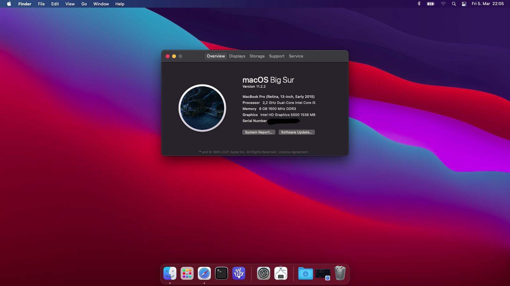

# Acer E5 771G - Big Sur OpenCore 0.6.7

CFG Lock disable not possible on this device.
Hold Fn + Tab at Boot then release and spam F2 to toggle Advanced Menu in Bios.

## Requirements / Values to look out for

Framebuffer hack has been removed from the EFI as has the dGPU disable ACPI file as I have found the combination of BIOS values that work. Please keep in mind if you get any of the following steps wrong and you get a black screen after restart you're going to have to reset your BIOS by opening your laptop. When you do just disconnect the battery, disconnect the coin battery that keeps the BIOS values saved and hold the Power button for at least 15 seconds before reconnecting everything and powering your laptop back on.

Disable dGPU:
Under the Advanced tab -> Video Configuration set Special Features to Disabled; Primary Display should be set to IGFX.

These values depend on each other so don't change them individually. Enabling the dGPU is as easy as setting these values back to default.

iGPU DVMT:
Again under the Advanced tab > Video Configuration -> Internal Graphic Device set the IGD - Aperture Size to 256 MB; IGD - DVMT Pre-Allocated to 128 MB; IGD - DVMT Size to 128 MB.

It seems like any other combination breaks when having only MacOS installed (ex. I could set Apeture Size to whatever value I wanted under Windowsbut 256 MB is maximum under this configuration) and it seems like DVMT Size is stuck at 128 MB if we want to be able to touch Pre-Allocated value at all(which we need to change to at least 64 MB remove the framebuffer hack)

If anyone has the time feels free to message me or open an issue if you find a better combination.

## What works:

HD 5500 iGPU

Realtek 8168/8111 Ethernet

Intel AC 3160 Wifi (with AirportItlwm limited functionality)

Bluetooth (Integrated in AC 3160)

HDMI

Webcam

Microphone

Realtek ALC 283 Audio

Samsung 860 Evo SATA SSD

FileVault

## Work in progress:

Touchpad (Works with Basic driver set in BIOS with PS2 kext. When I tried switching to HID it would freeze on boot at "HID: Legacy SHIM 2")

Sleep (Managed to get it to sleep by setting Webcam to internal in Usbmap but it reboots when you try to wake it. I tried many bios and settings combinations, tweaked power management and even tried changing SMBios but nothing seems to work atm. Hopefully Apple and/or OpenCore will fix this eventually. Log reports "EFI/Bootrom Failure after last point of entry to sleep". )

Fn + Brightness keys (Every Fn combination works besides this one. Brightness up is at Pause/Break. Needs patching)

Battery (Doesn't look accurate, requires extensive patching so no guarantees I'll ever get around to it)

## Outright doesn't work:

840m dGPU (Disabled in Bios)

SD Card Reader (Not gonna lose any sleep over this one)

## Not tested in a Windows or Linux dual boot setup so no guarantees there.

Refer to OpenCore's Apple Secure Boot post install guide on how to set ApECID, otherwise Wifi won't load and you might have issues booting.

